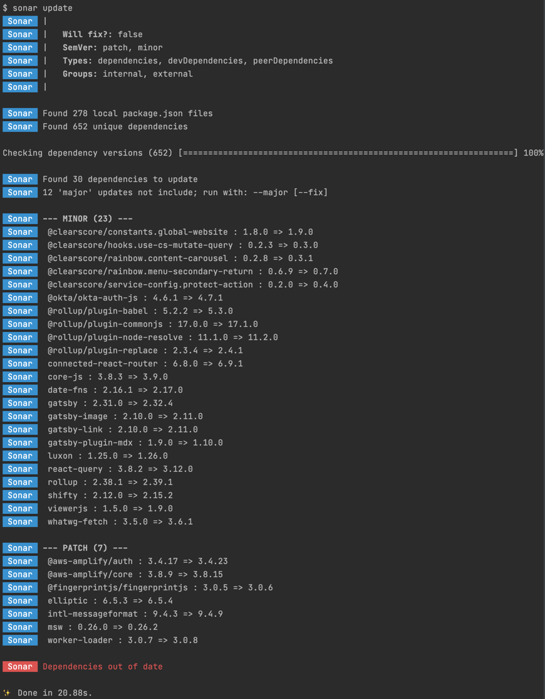

# Sonar

> Fine tune all your mono-repo dependency synchronisation, updates and validation.

When working with dependencies within mono-repo's, there a number of workflows we typically do; workspace synchronisation, dependency updates and validation.

Sonar will warn you of any errors within these workflows by default, or you can pass `--fix` to get Sonar to update the package.json files for you.

Using the `--fail` flag will cause Sonar to exit with an error, great for CI pipelines.

```sh
sonar [cmd] [options] [--fix] [--fail]
```

- [Workspace Synchronisation](#workspace-synchronisation)

  - [default](#sync-default): `sonar sync`
  - [remote](#remote): `sonar sync --remote`
  - [bump](#bump): `sonar sync --bump`

- [Dependency Updates](#dependency-updates)

  - [default](#update-default): `sonar update`
  - [internal](#internal): `sonar update --internal`
  - [external](#external): `sonar update --external`
  - [patch](#patch): `sonar update --patch`
  - [minor](#minor): `sonar update --minor`
  - [major](#major): `sonar update --major`
  - [canary](#canary): `sonar update --canary=my-canary-10.0`
  - [pattern](#pattern): `sonar update --pattern=mdx`
  - [groups](#groups): `sonar update --group=my-group`

- [Validation](#validation)
  - [versions](#versions): `sonar validate --versions`
  - [unused](#unused): `sonar validate --unused`

Sonar give you the ability to fine-tune these workflows for local development and CI. By default, zero config needed and out of the box, Sonar will 'patch' and update 'minor' dependency releases. To set your own defaults, add a [`sonar.config.js`](sonar.config.example.js)

## Workspace Synchronisation

> `sonar sync [options]`

Useful to get everything back inline after a bad merge/rebase, or a semi-failed 'publish'. For example, when using CI to publish packages, sometimes a new version might be published, but the pipeline fails while pushing to git.

### Sync default

> Ensure all usages of workspace packages have the correct version number.

```sh
sonar sync
```

### remote

> Ensure all workspace packages have the latest version number.

_Don't forget to ensure you are either on the latest master branch, or has rebased from master first!_

```sh
sonar sync --remote
```

##### bump

> Bump all workspace packages. This will give you a prompt to state to bump by major, minor or patch.

We recommend to use with `--remote` to keep everything up to date on each run;

```sh
sonar sync --bump --remote
```

_note: you do not need the --fix command as 'bump' will always update the package.json files_

## Dependency Updates

> `sonar update [options]`

We recommend you update `--patch` and `--minor` releases separately from `--major` updates. This is so that updates are as smooth as possible, and you can take time over any required 'major' updates.

### Update default

> By default, sonar will try to find updates for all dependencies, in all sem-ver ranges and withing all groups.

```sh
sonar update
```

### internal

> 'Internal' scopes are those packages that are created in-house. They may, or may not, live in within the same repo.

We recommend setting 'internal scopes' via the config file

```sh
# .sonarerc.js
module.exports = {
    internalScopes: ['@clearscore'],
};
```

```sh
sonar update --internal
```

### external

> 'External' scopes are those packages that are not marked as 'internal' (above).

```sh
sonar update --external
```

### patch

> Find those external dependencies that have had 'patch' releases

```sh
sonar update --minor --fix
```

### minor

> Find those external dependencies that have had 'minor' releases

```sh
sonar update --minor --fix
```

### major

> Find those external dependencies that have had 'major' releases

Omitting the `--fix` flag is good start when researching what updates we should be thinking about making in the future.

```sh
sonar update --external --major
```

### canary

> Find and update all deps that have a canary version which has a partial match to the given string

This is really powerful if you release a 'canary' package update, which also causes many other canary releases. Using --canary will allow you to update all affected packages at once.

```sh
sonar update --canary=chore-june-monthly-deps-update-10.0
```

### pattern

> Restrict updates to those depencies whose name matches the RegEx pattern

```sh
sonar update --pattern=eslint
# or
sonar update eslint
```

### groups

> We can create 'named groups' to allow us to update multiple packages at once. The best place for this is the config file

```js
// .sonarerc.js
module.exports = {
  groups: {
    lint: '^eslint(.*)?|stylelint',
    build: 'babel|rollup|postcss',
    test: 'jest|enzyme|cypress',
  },
};
```

With this configured, we can now target a specific update group

```sh
sonar update --group=build
# or
sonar update --group=test
```

## Validation

> `sonar validate [options]`

### versions

> Validate that all dependency versions are in the same version.

Having multiple versions of the same dependency can cause a lot of trouble within mono-repo's, and I'd prefer to save time by keeping all versions the same!

using the `--fix` option here will allow you to pick which version to use

```sh
sonar validate --versions
```

### unused

> Ensure that each package within the mono repo has every dependency within the package.json

We use [DepCheck](https://github.com/depcheck/depcheck) to do the heavy lifting here, and we add on the ability to auto-fix the results.

To know the difference between 'devDependencies' and production 'dependencies' we need to use the `devPatterns` option.

To pass in options to DepCheck, add a `depCheckConfig` option into the config file. This will be 'deep-merged' without our defaults.

Some times packages have 'global' dependencies, so if you wish _not_ to check a package then use the `ignoreUnusedInPackages` option.

```js
// sonar.config.js
module.exports = {
  ignoreUnusedInPackages: ['ignoreUnusedInPackages'],
  devPatterns: [
    '__mock__/*',
    'mock/*',
    '*.test.js',
    '*.spec.js',
    '*.stories.js',
    'tests',
    'test-resources',
    'cypress',
    'storybook',
  ],
  depCheckConfig: {
    ignoreMatches: ['jest-junit', '@commitlint/config-conventional'],
    ignorePattern: ['dist', 'build'],
  },
};
```

```sh
sonar validate --unused
# or
sonar validate --depCheck
```

We recommend you _never_ include 'devDependencies' into the workspace package unless it affects the consumable code (like a build tool). For this reason, we should exclude _all_ test and mock files from our checks.

The `--fix` for this command will automatically move all dev-only dependencies to the root of the workspace.

## CLI options

\_with any boolean option, the `no-` prefix is available to set it to false, in-case it is true by default, or has been set to true via the config file. e.g. `--no-patch` or `--no-peer`

```sh
Commands:

# sync
  sonar sync                                         Keep usages of workspace pakages in sync with the current versions
  sonar sync --remote                                Update workspace package version to the latest
  sonar sync --bump                                  Bump workspace package versions by a specified amount (major, minor or patch)

# update
  sonar update --internal                            Update scopes flagged as internal
  sonar update --external                            Update scopes not flagged as internal
    --patch                       [default: true]    Update to the latest patch semantic version
    --minor                       [default: true]    Update to the latest minor semantic version
    --major                      [default: false]    Update to the latest major semantic version
    --deps, --dependencies        [default: true]    Update dependencies
    --dev, --devDependencies      [default: true]    Update devDependencies
    --peer, --peerDependencies    [default: true]    Update peerDependencies
    --canary                        [default: ""]    Only target dependencies that have the specified carnary release
    --pattern                       [default: ""]    Only target dependencies matching the given pattern
    --group                         [default: ""]    Only target dependencies matching the aliased pattern

# validation
  sonar validate --versions                          Ensure all dependencies are on the same version
  sonar validate --unused                             Ensure all required dependencies exist in the package.json

More Options:
  --fix                          [default: false]    Fix any errors and update any relevant package.json files
  --fail                         [default: false]    Terminate the process with an error if there are any needed changes
  --folder                         [default: "."]    Where to look for package.json files
  --concurrency                     [default: 10]    Change how many promises to run concurrently
  --version                                          Show version number
  -h, --help                                         Show help

# Examples:
#  sonar update "babel|postcss|eslint|jest"  Update minor versions of babel, postcss, eslint and jest dependencies
#  sonar update --external --major babel     Update only external dependencies with a name containing babel
#  sonar update --canary feat-update         Update all dependencies with a release containing feat-update
#  sonar sync --remote                       Update workspace package versions and ensure all usages are up-to-dae
#  sonar validate                            Validate each unused of all dependencies are the same

```

## What will be updated?

When version numbers are pinned (e.g. '1.2.3'), and a new patch is available, the package.json will be rewritten to match the new version (e.g. '1.2.4').

Using version ranges like caret (^), tilde (~) or wildcards may mean there is nothing to update.

e.g.

- `1.0.x` or `~1.0.4` will not be updated if a new patch is released, but will be updated if a new minor release becomes available (`1.1.x` or `~1.1.0`)
- `1.x` or `^1.0.4` will not be updated if a new minor is released, but will be updated if a new major release becomes available (`2.x` or `^2.0.0`)

For more information go here: https://docs.npmjs.com/about-semantic-versioning

## Example

**Config**

[sonar.config.js example](sonar.config.example.js)

**Output**



# todo

- ALL: add `--interactive` (`-i`) option. keep changes in memory and ask `fix` each change?
- update:
  - update patch/minor version even if there is a major available
- validate:
  - unused: recognise 'nodeJs' globals
  - unused: add option to ignore whole workspace package
  - versions: validate peerDeps are met
  - versions: validate resolutions are met
  - deprecations: build it!
